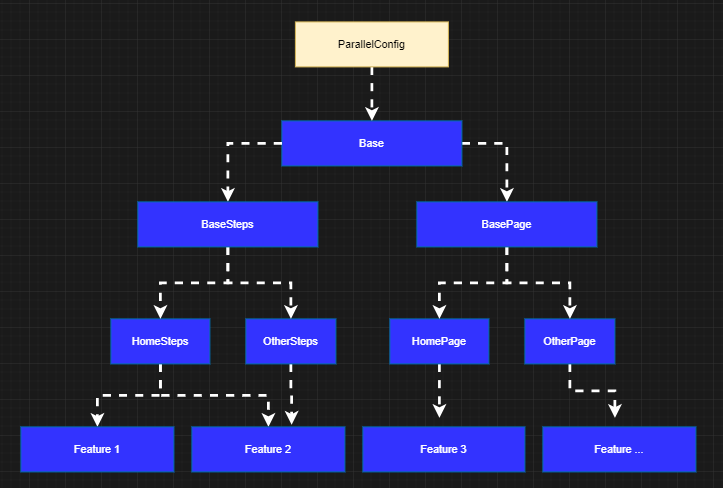

# SeleniumNUnitFramework
This a simple example of how to run specflow tests in parallel in a docker container using selenium WebDriver + NUnit + Page Objects.

<!--  -->

Tech stack:

- .Net core 3.1
- NUnit
- WebDriverManager 2.11.x
- Selenium Support 3.141.0
- Specflow 3.7.13
